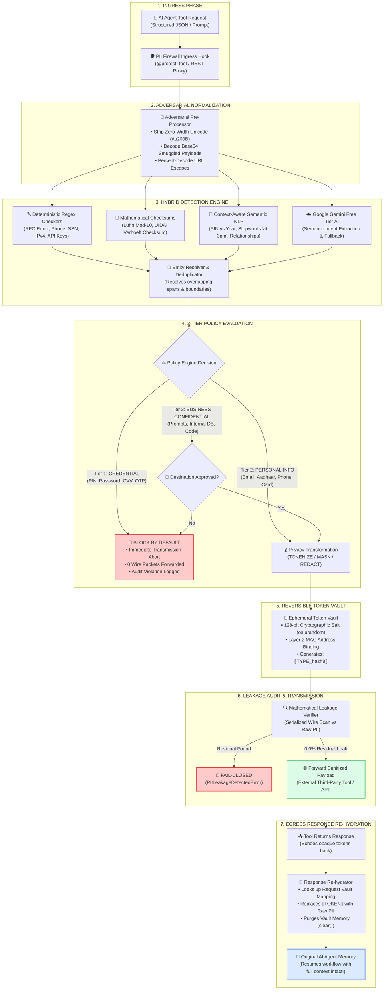

# 🗺️ System Flow Design & Data Pipeline Architecture

> **PS-03 | COMMVAULT CHALLENGE | CYBERSECURITY • DATA PRIVACY**  
> **PII Firewall for AI Agents — End-to-End Execution Flow & Transformation Lifecycle**

---

## 1. High-Level System Flow Diagram



---

## 2. Step-by-Step Data Transformation Lifecycle

Below is an exact trace of a sample agent tool call containing **Personal PII**, **Financial Identifiers**, and **Operational Stopwords**:

### Step 1: Raw Input from AI Agent
```json
{
  "tool": "send_email",
  "arguments": {
    "to": "sharath@gmail.com",
    "subject": "Leave Request",
    "message": "Verify Aadhaar 2345 6789 0123. Meeting at 3pm on 31st nov."
  }
}
```

### Step 2: Adversarial Normalization
* Strips invisible zero-width spaces (`\u200B`) and normalizes Unicode NFKC.
* Resolves obfuscated emails (`adithya [at] domain [dot] com`) into standard forms.
* Flags Base64-smuggled strings for nested inspection.

### Step 3: Hybrid Detection & Context Evaluation
* **Email Recognizer**: Detects `sharath@gmail.com` as `PIIType.EMAIL`.
* **Aadhaar Recognizer**: Validates `2345 6789 0123` via **UIDAI Verhoeff Checksum Algorithm** $\rightarrow$ Confirmed Valid.
* **Stopword Suppression Engine**: Analyzes `"at 3pm"` and `"31st nov"`. Confirms they are scheduling parameters, preventing false identification as phone numbers or identifiers.

### Step 4: 3-Tier Policy Engine Routing
* Action selected: **`TOKENIZE`**.
* Both entities are assigned to Tier 2 (`PERSONAL_INFO`).
* If credentials like an ATM PIN (`4821`) or CVV had been present, Tier 1 (`CREDENTIAL`) would have immediately triggered **BLOCK BY DEFAULT**, aborting transmission.

### Step 5: Ephemeral Token Vault Generation
* Unique request salt: `s_8f3a9e21...` (128-bit random salt in volatile RAM).
* Opaque Token Mappings:
  * `"sharath@gmail.com"` $\rightarrow$ `⟦EMAIL_a7b8c9d0⟧`
  * `"2345 6789 0123"` $\rightarrow$ `⟦AADHAAR_e1f2a3b4⟧`

### Step 6: Leakage Verifier & Wire Transmission
* The outgoing wire payload is serialized into raw bytes.
* The `LeakageVerifier` performs a full substring search for all original values.
* **Audit Result:** **0.0% Residual Cleartext PII**.
* Packet transmitted to the simulated external tool:
```json
{
  "tool": "send_email",
  "arguments": {
    "to": "⟦EMAIL_a7b8c9d0⟧",
    "subject": "Leave Request",
    "message": "Verify Aadhaar ⟦AADHAAR_e1f2a3b4⟧. Meeting at 3pm on 31st nov."
  }
}
```

### Step 7: External Tool Execution & Response Re-Hydration
1. Third-party tool executes successfully and echoes tokens in its confirmation:
```json
{
  "status": "success",
  "delivered_to": "⟦EMAIL_a7b8c9d0⟧",
  "message_id": "msg_98231",
  "body": "Processed Aadhaar ⟦AADHAAR_e1f2a3b4⟧"
}
```
2. The **PII Firewall Intercepts the Inbound Response**:
   * Resolves `⟦EMAIL_a7b8c9d0⟧` $\rightarrow$ `sharath@gmail.com`
   * Resolves `⟦AADHAAR_e1f2a3b4⟧` $\rightarrow$ `2345 6789 0123`
   * Purges ephemeral vault memory (`vault.clear()`).
3. **Final Result Delivered to AI Agent**:
```json
{
  "status": "success",
  "delivered_to": "sharath@gmail.com",
  "message_id": "msg_98231",
  "body": "Processed Aadhaar 2345 6789 0123"
}
```
* **Security Outcome:** AI agent resumes autonomous workflow with full context intact, while **zero cleartext PII ever crossed the external network boundary**!

---

## 3. Defense-in-Depth Summary Table

| Pipeline Stage | Security Mechanism | Failure Behavior | Latency Overhead |
|:---|:---|:---|:---:|
| **Ingress** | Decorator `@protect_tool` / REST Sidecar | Rejects malformed JSON | < 0.1 ms |
| **Normalization** | Unicode NFKC, Zero-width strip, Base64 decode | Cleans invisibles | ~0.2 ms |
| **Detection** | Regex + Luhn + Verhoeff + Context NLP + Gemini | Graceful local fallback | ~0.8 ms |
| **Policy** | 3-Tier Security Architecture | Credentials Fail-Closed | < 0.1 ms |
| **Token Vault** | 128-bit Salted HMAC in ephemeral RAM | Replay rejection | ~0.1 ms |
| **Verification** | Raw wire payload string audit | Aborts wire dispatch | ~0.2 ms |
| **Total Added Processing Overhead** | **Sub-millisecond to ~1.5 ms** | **Fail-Closed Guarantee** | **~1.4 ms (< 25ms SLA)** |
